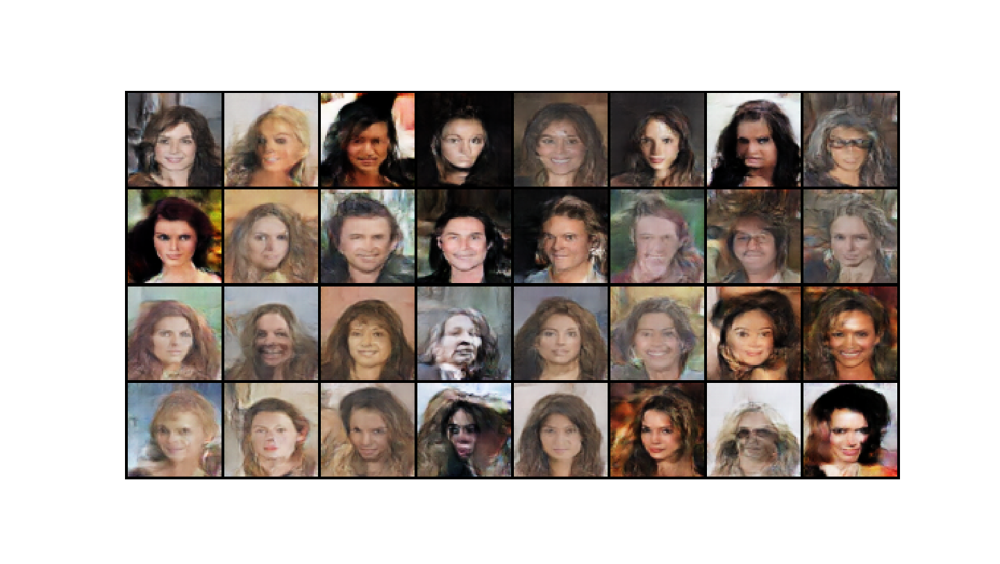

# SN-GAN

#### Title
[Spectral Normalization for Generative Adversarial Networks](https://arxiv.org/abs/1802.05957)

#### Abstract
One of the challenges in the study of generative adversarial networks is the instability of its training. In this paper, we propose a novel weight normalization technique called spectral normalization to stabilize the training of the discriminator. Our new normalization technique is computationally light and easy to incorporate into existing implementations. We tested the efficacy of spectral normalization on CIFAR10, STL-10, and ILSVRC2012 dataset, and we experimentally confirmed that spectrally normalized GANs (SN-GANs) is capable of generating images of better or equal quality relative to the previous training stabilization techniques.

## Result

* The results are generated by trained network using **celeba** dataset during **10 epochs**.

## Train
    $ python main.py --mode train --scope [scope name]

* Set **[scope name]** uniquely.

## Test
    $ python main.py --mode test --scope [scope name]

* Set **[scope name]** to test using scoped network
* In **result** folder, generated images are saved under the **images** subfolder.
* In addition, **index.html** are created to illustrate the generated images.  

## Tensorboard
    $ tensorboard --logdir log/[scope] --port [(optinal) 4 digit port number]

Then, click **http://localhost:6006**

* You can change **[(optinal) 4 digit port number]**
* 4 digit port number = 6006 (default)
